## Gatsby란?

Gatsby는 React와 GaraphQL을 기반으로 정적 사이트를 만드는 프레임워크입니다. 

정적 사이트를 만들어주는 도구들은 여러가지가 있는데, ([Site Generators](https://jamstack.org/generators/)) Gatsby는 markdown을 html로 변환하도록 설계가 되었고, React로 page와 templates를 개발자 마음대로 만들고 변경할 수 있다는 것에 장점이 있습니다. 

그리고 Gatsby는 다양한 plugin들을 제공하는데, 블로그를 만듦에 있어서 상당히 유용한 것들이 많이 있습니다.

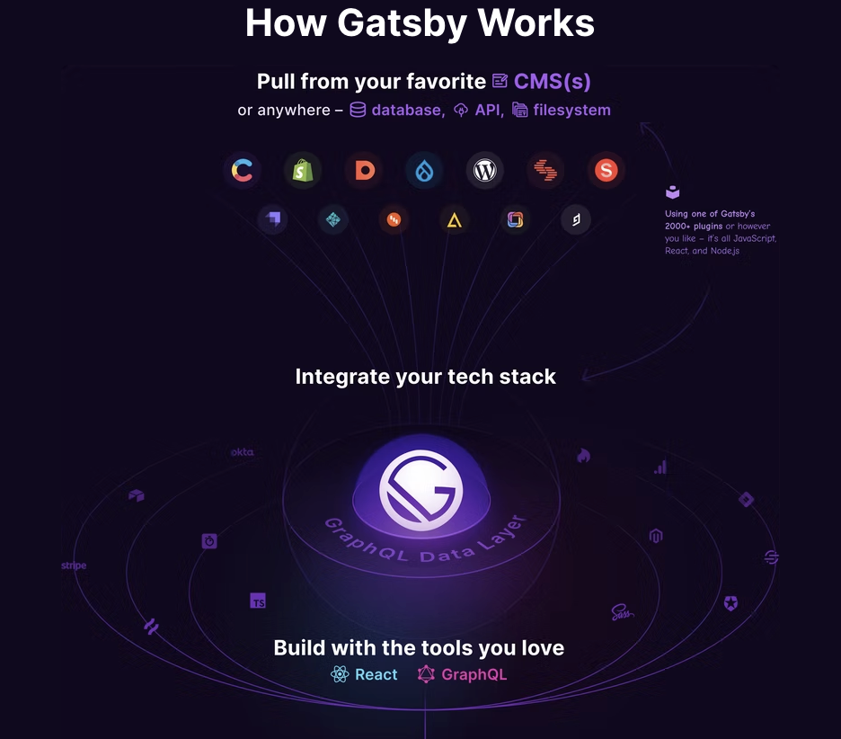

## Gatsby로 블로그를 만든 이유

위에도 설명이 되어있지만, Gatsby는 React와 GraphQL로  정적 사이트를 만드는 프레임워크인 것이 좋아보였습니다. 단순 게시물 뿐만아니라, React를 사용하기 때문에, React로 해보고 싶은 것들을 해보는 공간을 만들 수 있게되었습니다. 그리고 typescript가 지원이 되기 때문에, 블로그의 코드를 좀 더 쉽게 관리 할 수 있을 것 같았습니다.

## Gatsby 생성

### 무작정 생성

Gatsby는 npm에서 gatsby를 설치하여 생성하는 방법이 있고, npx로 간편하게 할수도 있습니다.
```bash
npm install -g gatsby
gatsby new my-blog

// or

npx gatsby new my-blog
```
(저는 npx를 사용하는게 편하고, 글로벌로 설치하고 싶진않아서 npx를 사용했습니다.)

위의 명령어에서 “my-blog”에 원하는 프로젝트명을 작성하시면 됩니다. 

### Gatsby Starter Library 사용

Gatsby는 Starter 팩? 기본 템플릿들을 제공하는데 (참고: [Gatsby Starter Library](https://www.gatsbyjs.com/starters/)) 원하시는 것을 선택하여 생성할 수 있습니다. 저는 blog를 선택해서 여러가지를 추가했습니다.

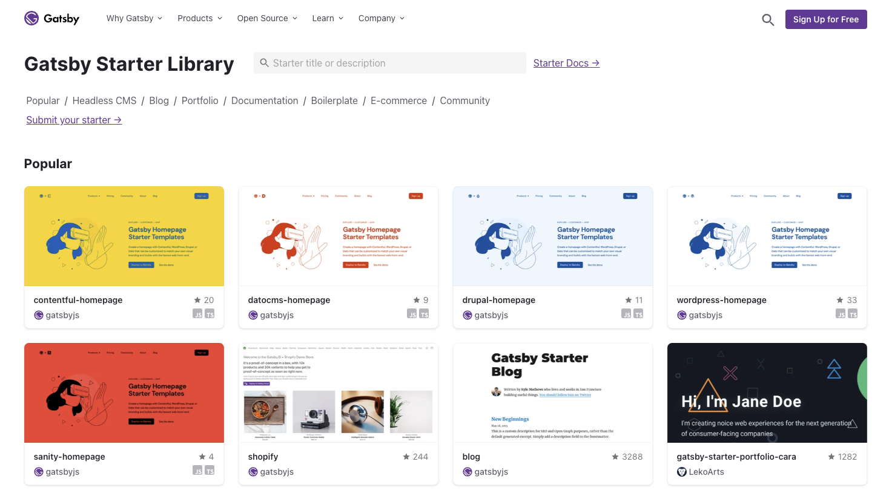

모든 템플릿들을 클릭하자마자 Demo를 볼 수 있고, 기본적으로 설치되어있는 Dependencies로 알려주기 때문에 선택하는 것에 좋은 UX를 제공해주는 것 같습니다.

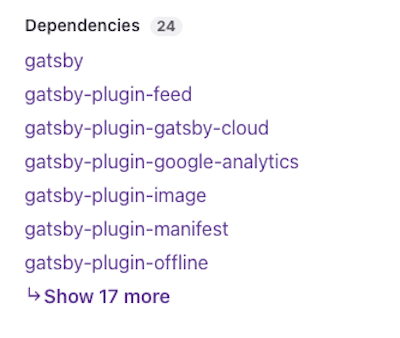

생성 명령어는 상세페이지로 들어가면 복사할 수 있습니다.

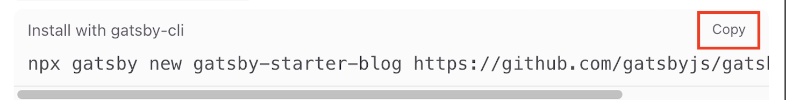

new 바로 다음에 오는 파라미터는 생성되는 프로젝트의 이름이면서 폴더의 이름으로 생성되니, 원하는걸 넣으시면 됩니다.

생성된 템플릿들마다 조금씩 다르게 설정되어 있긴한데, package.json을 보시면 
```bash
gatsby develop
```
를 사용하는 script가 있을 것입니다. (없으면 그냥 만들어주면 됩니다.)

저는 이렇게 해 주었습니다.
```json
// package.json

"scripts": {
  "start": "gatsby develop",
  ...
}
...
```
해당 script를 실행하면, 개발서버를 띄울 수 있고 graphQL playground까지 함께 켜지는 것을 볼 수 있습니다.
```bash
npm run start
// start에 추가하면 좋은점 -> run 안붙여도됨 😀
npm start
```
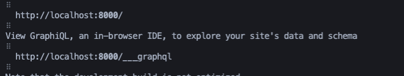

이렇게 하면 Gatsby로 프로젝트를 생성하고, 간단하게 개발서버를 켜는 것 까지 할 수 있습니다.

## Gatsby를 Github page에 배포하기

간단하게 플로우만 설명드리면 아래와 같습니다.

- git page로 사용할 repository 생성
- dev 브랜치에는 gatsby코드를 저장
- dev 브랜치에서 빌드한 후에 빌드된 파일들을 master 브랜치에 push하여 배포

먼저 git page로 사용할 repository를 생성해 보겠습니다.

### git repository 생성하기

1. 여러 경로가 있겠지만, [github](https://github.com/)에서 해더의 메뉴의 New Repository를 클릭합니다.
    
    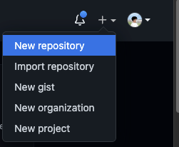
    
2. Repository Name은 블로그로 사용하려면, 규칙이 있습니다. “<github아이디>.github.io”이렇게 자신의 아이디를 서브도메인으로 하고, github.io를 뒤에 붙혀주시면 됩니다.
    
    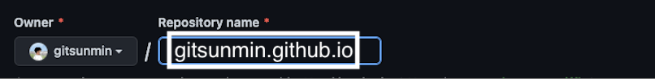
    
3. Public으로 사용하여야합니다.
    
    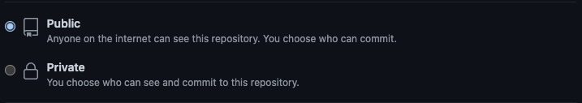
    
4. Create Repository 버튼을 눌러줍니다.
    
    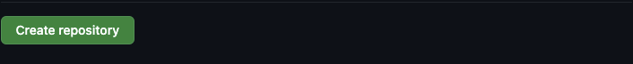
    

### 개발용 브랜치에 gatsby 프로젝트 저장

1. Repository URL을 복사합니다. (SSH를 사용해도 됩니다.)
    
    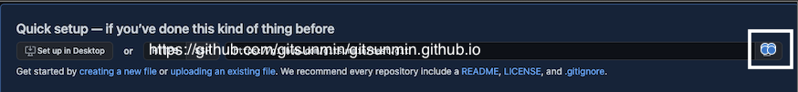
    
2. Gatsby 프로젝트로 이동 후에, git 명령어로 Repository를 연결합니다.
    ```bash
    git remote add origin <복사한 URL>
    ```
3. Gatsby 프로젝트를 계속 개발할 브랜치를 생성해 줍니다. (master는 배포용으로 두려고 합니다.)
    ```bash
    // git branch <생성할 브랜치> <복사할 브랜치>
    git branch dev master
    ```
4. dev 브랜치에서 push를 해줍니다. 이렇게 하면 dev 브랜치에 잘 올라간 것을 확인할 수 있습니다.
    ```bash
    git push --set-upstream origin dev
    ```
### 배포용 브랜치에 빌드된 gatsby 저장

빌드를 한 다음에 빌드된 폴더를 복사해 두었다가, master 브랜치로 옮겨서 배포를 해도 되지만, 이것을 간편하게 할 수 있는 방법이 있습니다. → [gh-pages](https://www.npmjs.com/package/gh-pages)

1. 대부분 gh-pages가 설치되어있겠지만, 안 되어있는 경우에는 설치를 해줍니다.
    ```bash
    npm install gh-pages --save-dev
    ```
2. 저는 master 브랜치에서 배포를 할 것이기 때문에, 아래와 같이 script에 등록 해주었습니다. 
    ```json
    "script": {
      "deploy": "gatsby build && gh-pages -d public -b master",
      // gatsby build: gatsby 프로젝트를 빌드하는 명령어
      // &&: 이전 명령이 완료되면 다음 명령을 실행
      // gh-pages -d public -b master
      // : public 폴더를 master 브랜치로 push 합니다. 
      ...
    }
    ...
    ```
3. dev브랜치에서 등록한 script를 실행 해 보겠습니다.
    ```bash
    npm run deploy
    ```
4. master 브랜치를 확인 하시면 push가 된 것을 확인할 수 있고 빌드된 파일들을 볼 수 있을 것입니다.
5. 이제 master 브랜치의 코드가 배포되도록 설정을 하면됩니다.

    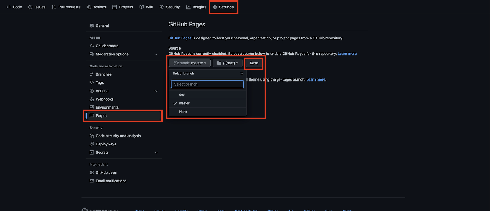
6. 그러면 5 ~ 10분 뒤에 브랜치명으로 배포가 된 것을 확인할 수 있습니다. 저는 [gitsunmin.github.io](http://gitsunmin.github.io/) 이렇게 되었습니다.

## 결론

이제 dev 브랜치에서 만들고 싶은 것을 만들고, master로 배포하여 관리하시면 될 것 같습니다.