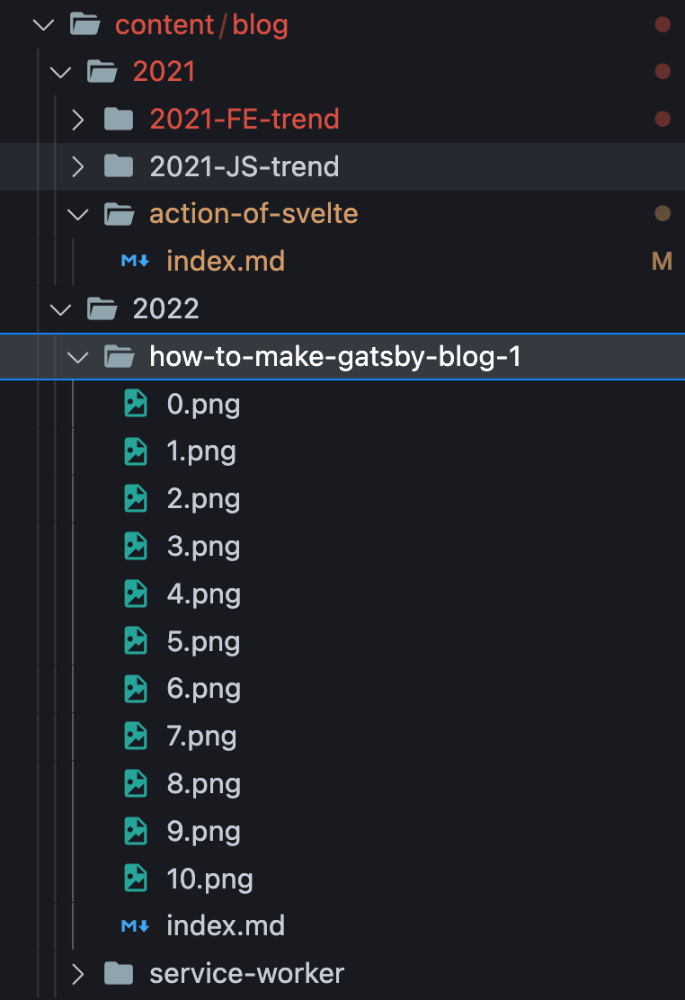
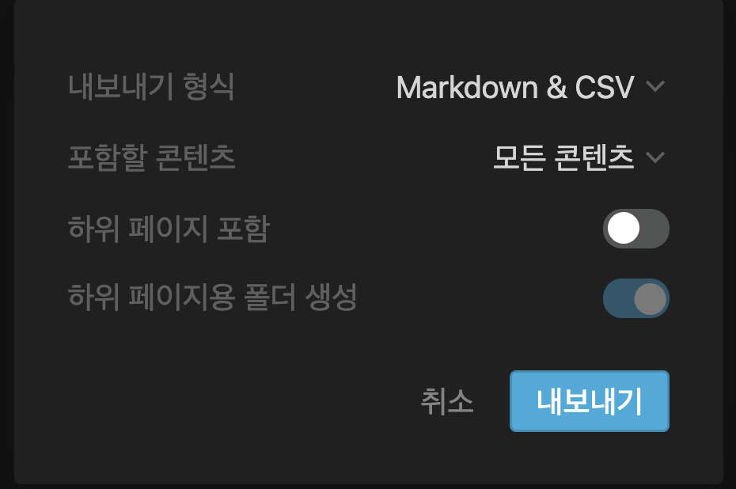
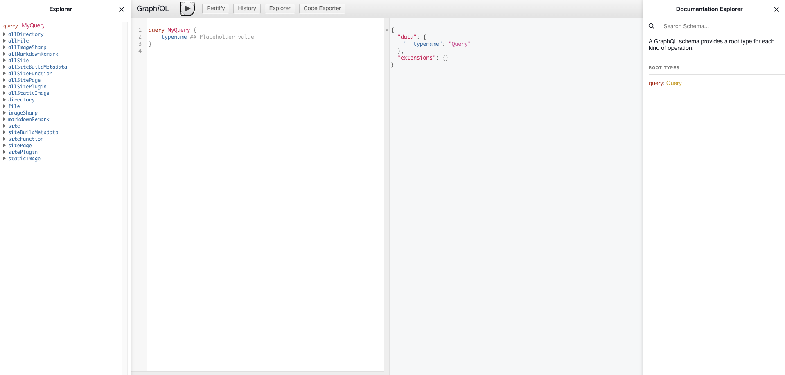
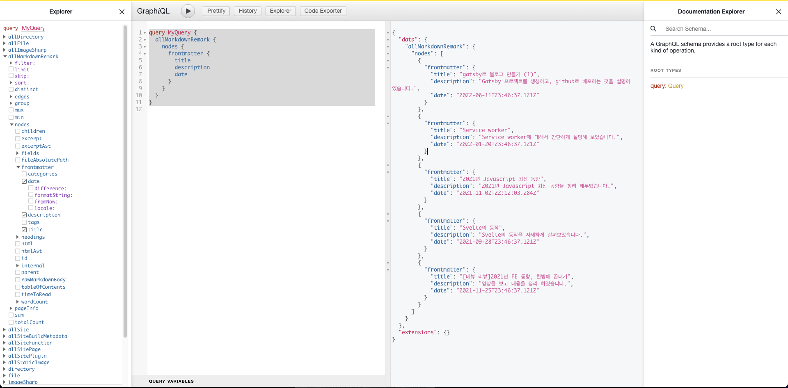
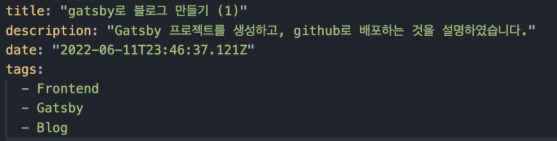
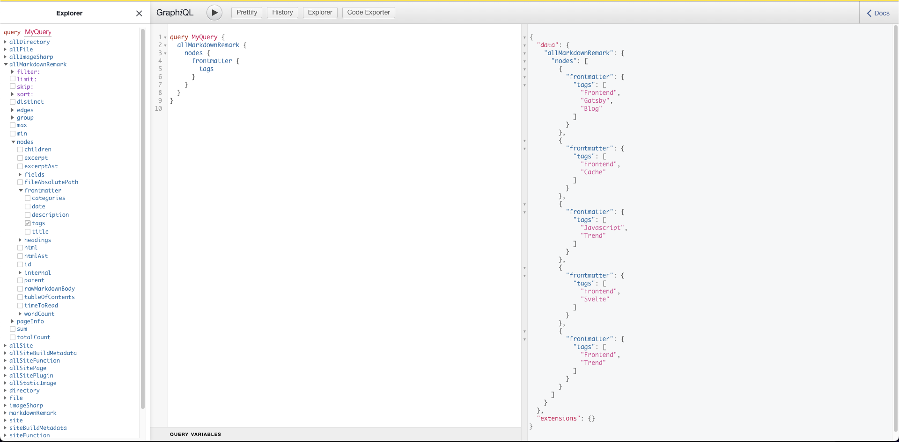
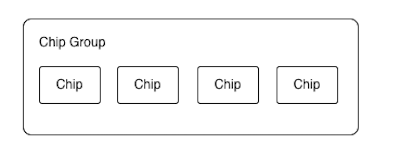
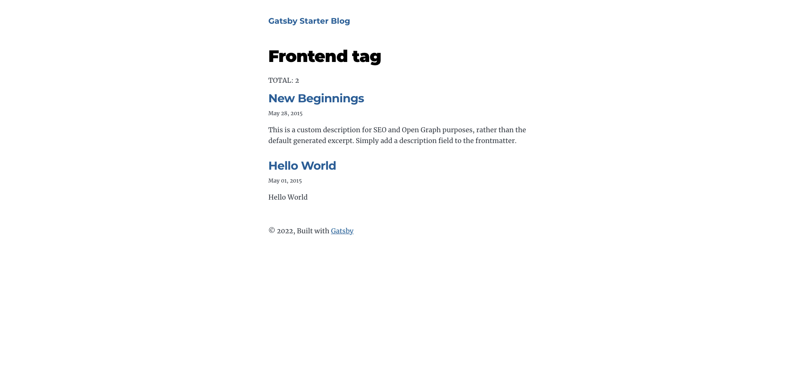

## 게시물 작성하기

[starter](https://www.gatsbyjs.com/starters/)로 설치 시에 content 폴더에 markdown으로 작성된 문서들이 있을 것입니다. 저는 Blog를 사용하였는데, Blog 에서는 위의 markdown을 기반으로 Gatsby 사이트의 게시물을 관리할 수 있습니다. 제가 관리하고 있는 구조를 설명하자면, 아래와 같습니다.



년도로 구분을 하고, 게시물을 폴더로 생성한 뒤에 해당 게시물에 필요한 이미지 파일들과 함께 index.md를 구성하였습니다. index.md에는 게시물 내용을 작성하였습니다. 이렇게 작성하면


그림의 경로를 설정하기가 쉬워서 좋습니다.

저는 게시물을 작성할 때, Markdown으로 작성하기 보다는 Notion으로 작성한 뒤에 내보내기한 뒤에 다운로드된 파일을 조금 수정하여 게시물을 올리고 있습니다.



작성하는 방법은 다양하게 있을 것 같습니다.

## GraphQL 사용

보통 GraphQL은 백엔드 서버와 통신을 하기 위해 존재하지만, Gatsby에서는 데이터를 관리하는 목적으로 프론트엔스 서버에 존재하고 있습니다.

“데이터를 관리한다”는 의미는 페이지 마다, 혹은 react 컴포넌트 또는 어디서든 어떤 데이터든 조회하여 사용할 수 있도록 만들어져 있다는 뜻입니다.

### playground 살짝 맛 보기

[http://localhost:8000/\_\_\_graphql](http://localhost:8000/___graphql)

개발서버를 켠 뒤에 위의 링크로 접속하게 되면, 아래와 같은 창이 뜨면서 현재 Query할 수 있는 목록을 제공해줍니다.



playground는 총 4개의 영역으로 구분이 되어있는데, 왼쪽부터

- Query의 목록
- 조회할 Query (play버튼을 누르면 결과를 볼 수 있습니다.)
- 2번째 영역의 Query의 조회 결과값
- GraphQL의 Schema

```javascript
query MyQuery {
  allMarkdownRemark {
    nodes {
      frontmatter {
        title
        description
        date
      }
    }
  }
}
```

이 Query는 markdown으로 작성한 게시물들의 모든 정보를 조회하는 Query입니다.



이 playground에서 여러가지 조회해보면서 원하는 데이터를 찾아서 pagq나 component에서 사용하시면 됩니다.

### Pagq에서의 사용

프로젝트 생성 시 처음에 있는 src/pages/index.js 를 보시면, 아래쪽에 `pageQuery` 라고 있는것이 보일 것입니다. (참고: [https://www.gatsbyjs.com/docs/how-to/querying-data/page-query/](https://www.gatsbyjs.com/docs/how-to/querying-data/page-query/))

```javascript
export const pageQuery = graphql`
  query {
    site {
      siteMetadata {
        title
      }
    }
    allMarkdownRemark(sort: { frontmatter: { date: DESC } }) {
      nodes {
        excerpt
        fields {
          slug
        }
        frontmatter {
          date(formatString: "MMMM DD, YYYY")
          title
          description
        }
      }
    }
  }
`
```

여기서 pagqQuery 이름은 중요한 값은 아닙니다. 아무런 이름으로 해도, 페이지가 로드 되기 전에 해당 query를 조회합니다.

그리고는 export default로 내보내는 javascript에서 data라는 이름의 props로 받아서 사용할 수 있습니다.

```javascript
const BlogIndex = ({ data, location }) => {
...
}
```

### Components에서의 사용

Pagq에서는 위와 같이 페이지가 로드되기 전에 미리 불러오는 방법으로 사용을 하지만, Component에서는 원하는 시점에 GraphQL을 호출할 수 있습니다.

(참고: [https://www.gatsbyjs.com/docs/how-to/querying-data/use-static-query/](https://www.gatsbyjs.com/docs/how-to/querying-data/use-static-query/))

src/components/bio.js 경로를 참고하시면 됩니다. 없으면, 아래의 코드를 보셔도됩니다.

```javascript
import { useStaticQuery, graphql } from "gatsby"

const Bio = () => {
  const data = useStaticQuery(graphql`
    query BioQuery {
      site {
        siteMetadata {
          author {
            name
            summary
          }
          social {
            twitter
          }
        }
      }
    }
  `)
}
```

이렇게 gatsby에서 useStaticQuery을 사용하면, 동기적으로 GraphQL을 사용하여 원하는 Query를 사용하여 javascript내에서 사용이 가능합니다.

## 태그 기능 추가


위 그림에서의 태그처럼 보이는 것은 제 블로그에서 사용중인 태그 스타일입니다. 이 태그 기능은 게시물 별로 구분할 수 있는 값을 설정하고, 같은 구분을 갖는 게시물들을 모아서 볼 수 있는 기능입니다.

이 기능은 위 섹션에서의 GraphQL을 사용하면 생각보다 편하게 구현할 수 있는 기능입니다.

### 게시물 마다 태그를 달기

markdown으로 작성된 게시물을 보면, 아래의 그림처럼 title, description, date가 있을 것입니다. 여기에 추가로 tags라는 key값으로 여러개의 tag들을 작성해 줍니다.



이렇게만 해 두어도, GraphQL playground에서 확인이 가능합니다. 이게 Gatsby의 장점인거 같아요.



이제 이 Query를 사용해서 tag 기능을 만들면 될 것 같습니다.

위 의 쿼리는 어디서 불러오면 될까요? 우선, 게시물의 최 하단에 데이터를 뿌려보겠습니다. 그러기 위해서는 src/templates/blog-post.js 이 파일을 수정해야합니다. 이 파일은 markdown으로 작성된 게시물이 실제 HTML로 변환되기 위한 템플릿으로서, gatsby-node.js 파일에서 createPage method를 이용하여 등록한 것입니다.

```javascript
# src/templates/blog-post.js 의 PageQuery

markdownRemark(id: { eq: $id }) {
  id
  excerpt(pruneLength: 160)
  html
  tableOfContents
  frontmatter {
    title
    date(formatString: "MMMM DD, YYYY")
    description
    tags # 이걸 추가해주면 위에서 작성한 tags를 조회할 수 있습니다.
    categories
  }
}
```

이렇게만 해 두면, data.markdownRemark.frontmatter.tags를 보면 해당 게시물의 tags 데이터를 불러올 수 있습니다.

이제 이 data로 UI를 만들어 주고, 해당 Tag의 페이지를 만들어 주면 태그 기능은 완성입니다.

### Tag UI 만들기



저는 위의 그림과 같은 구조로 Tag의 UI를 만들어 보았습니다. Chip 이라고하는 것에 tag를 넣고 이 Chip들을 감쌀 수 있는 Chip Group을 만들어서 Chip들이 항상 같은 Layout을 갖도록 해 두었습니다.

- Chip
  ```javascript
  import { navigate } from "gatsby"

  const Chip = ({ children, to }) => {
    const onClick = () => {
      to && navigate(to)
    }
    return <StyledChip onClick={onClick}>{children}</StyledChip>
  }

  export default Chip
  ```
  ```css
  .chip {
    height: 20px;
    background: rgb(220, 220, 220);
    padding: 0 4px;
    color: rgb(128, 128, 128);
    font-size: 13px;
  }

  .chip:hover {
    cursor: pointer;
    color: rgb(135, 206, 235);
    font-weight: bold;
    background: rgba(233, 233, 233, 0.96);
  }
  ```
- Chip Group
  ```javascript
  const ChipGroup = ({ children }) => <span class="chip-group">{children}</span>

  export default ChipGroup
  ```
  ```css
  .chip-group {
    display: flex;
    flex-wrap: wrap;
    align-items: center;
    width: inherit;
    gap: 8px;
  }
  ```

src/templates/blog-post.js 에서 원하는 위치에서

```javascript
<ChipGroup>
  {data.markdownRemark.frontmatter.tags?.map((tag, index) => (
    <Chip to={`/tag/${kebabCase(tag)}`} key={index}>
      {tag}
    </Chip>
  ))}
</ChipGroup>
```

- kebabCase: lodash의 함수인데, “Frontend”로 설정한 태그값을 “frontend”로 만들어 주는 함수입니다.

제가 만든 UI Components를 공유 하겠습니다: [Chip](https://github.com/gitsunmin/gitsunmin.github.io/blob/dev/src/components/UI/Chip.tsx), [ChipGroup](https://github.com/gitsunmin/gitsunmin.github.io/blob/dev/src/components/UI/group/ChipGroup.tsx)

- styled-components, styled-icons, typescript를 사용하여 컴포넌트를 만들어 보았습니다.

### Tag Page 만들기

우선 src/templates/blog-tag.js 파일을 만들어 줍니다. 그리고, 저는 src/pages/index.js를 참고하여 만들어 보았습니다.

```javascript
import React from "react"
import { graphql, Link } from "gatsby"
import Layout from "../components/layout"

const TagsTemplate = ({
  data,
  pageContext, // 이 값은 아래에 설명하겠습니다.
  location,
}) => {
  const { allMarkdownRemark, site } = data
  const { tag } = pageContext

  const siteTitle = site.siteMetadata?.title || `Title`

  return (
    <Layout location={location} title={siteTitle}>
      <span>
        <h1>
          <span className="tag">{tag}</span> tag
        </h1>
        <span>TOTAL: {allMarkdownRemark.nodes.length}</span>
      </span>
      <ul>
        {allMarkdownRemark.nodes.map((node, index) => {
          return (
            <ol key={index} style={{ listStyle: `none` }}>
              <li key={index}>
                <span
                  className="post-list-item"
                  itemScope
                  itemType="http://schema.org/Article"
                  key={index}
                >
                  <header>
                    <h2>
                      <Link
                        to={node.fields.slug}
                        itemProp="url"
                        state={{ previousPath: location.pathname }}
                      >
                        <span itemProp="headline">
                          {node.frontmatter.title}
                        </span>
                      </Link>
                    </h2>
                    <small>{node.frontmatter.date}</small>
                  </header>
                  <section>
                    <p
                      dangerouslySetInnerHTML={{
                        __html: node.frontmatter.description || node.excerpt,
                      }}
                      itemProp="description"
                    />
                  </section>
                </span>
              </li>
            </ol>
          )
        })}
      </ul>
    </Layout>
  )
}

export const query = graphql`
  query TagsTemplateQuery($ids: [String]!) {
    site {
      siteMetadata {
        title
      }
    }
    allMarkdownRemark(filter: { id: { in: $ids } }) {
      nodes {
        id
        excerpt
        fields {
          slug
        }
        frontmatter {
          title
          description
          date(formatString: "MMMM DD, YYYY")
          tags
        }
      }
    }
  }
`

export default TagsTemplate
```

이렇게 만들어진 javascript는 gatsby-node.js에서 등록을 해야합니다.

gatsby-node.js 파일을 보시면 `exports.createPages` 이 함수를 사용하고 있는것을 볼 수 있는데, 여기서 페이지를 만들 수 있습니다.

참고: [https://www.gatsbyjs.com/docs/reference/config-files/gatsby-node/#createPages](https://www.gatsbyjs.com/docs/reference/config-files/gatsby-node/#createPages)

`createPages`는 파라미터로 `object`를 받는데, 이 `object`에는 `action`, `graphql`, `reporter` 를 포함합니다.

- action: 페이지를 생성하는 함수를 포함합니다.
- graphql: GraphQL을 사용할 수 있다.
- reporter: 빌드 시 로그를 찍어준다.

플로우는 간단합니다. graphql로 tag데이터를 불러오고, 불러온 tag 데이터를 이용하여 action으로 tag별로 페이지를 만듭니다. 여기서 page는 위에서 만든 template을 사용해야합니다. 마지막으로 reporter로 페이지가 생성되었다는 것을 로그로 찍어 줍니다.

```javascript
// createPages안에서 graphql을 이용합니다. (tags를 포함합니다.)
...
const result = await graphql(
    `
      {
        allMarkdownRemark(sort: { frontmatter: { date: ASC } }, limit: 1000) {
          nodes {
            id
            fields {
              slug
            }
            frontmatter {
              tags
            }
          }
        }
      }
    `,
  );
...
```

가져온 tags 데이터를 하나의 Array로 만들기 위한 함수를 하나 만들어 줍니다.

```javascript
function flatTags(allMarkdownRemark) {
  const uniqueTags = new Set()
  allMarkdownRemark.nodes.forEach(node => {
    node.frontmatter.tags.forEach(tag => {
      uniqueTags.add(tag)
    })
  })
  return Array.from(uniqueTags)
}
```

위 의 함수를 사용하여 page를 만들어줍니다.

```javascript
const _ = require('lodash')
...

exports.createPages = async ({ graphql, actions, reporter }) => {
...
  const { allMarkdownRemark } = result;
  const tagTemplate = require.resolve('./src/templates/blog-tag.js');

    const flatedTags = flatTags(allMarkdownRemark);
    flatedTags.forEach((tag) => {
      createPage({
        path: `tag/${_.kebabCase(tag)}`,
        component: tagTemplate,
        context: { // context는 template에서 pageContext로 불러올 수 있습니다.
          tag, // 태그 이름을 넣어줍니다.
          ids: allMarkdownRemark.nodes
            .filter((node) => {
              return node.frontmatter.tags.includes(tag);
            })
            .map((node) => node.id),
        },
      });
      reporter.info(`Creating page: tag/${tag}`); // 생성된 tag 페이지를 로그로 표현합니다.
    });
...
}
```

이렇게 하시면 tag/{tag이름} 으로 url을 입력하시면, tag 페이지를 볼 수 있을 것입니다.

[http://localhost:8000/tag/frontend](http://localhost:8000/tag/frontend)


   

제 깃허브에 코드를 참고하셔도 좋을 것 같습니다. 참고: https://github.com/gitsunmin/gitsunmin.github.io
- styled-components, styled-icons, typescript를 사용하고 있습니다.
