## 배경

회사의 개발자 단체 방에서 추천하는 글이 있길래 한 번 찾아보았는데, 괜찮을 것 같아서 공부를 하게 되었습니다.

## Mermaid란?

문법에 맞추어서 markdown을 작성하면 UML로 변환하여 보여주는 툴입니다.

## vscode에서 사용

vscode에서는 Plugin([링크](https://marketplace.visualstudio.com/items?itemName=bierner.markdown-mermaid))을 사용해서 mermaind를 사용할 수 있습니다. 링크를 클릭하여 설치 한 후에, cmd + shift + p 를 눌러서 (window는 ctrl + shift + p로 가능합니다.) 검색창을 띄워서 아래의 내용을 검색하시면 됩니다.

```bash
> markdown:open Preview to the side
```

저는 간단하게 예시로 작성해 보았습니다.

```markdown
:::mermaid
graph RL;
A-->B;
A-->C;
B-->D;
C-->D;
:::
```

이 내용을 위 의 방법으로 preview를 보게 되면,

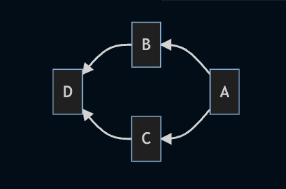

이렇게 UML을 그려주는 것을 확인할 수 있습니다.

```markdown
:::mermaid
:::
```

안에 작성해야합니다.

## 사용법

먼저, mermaid에서 제공하는 다이어그램에 대해서 알아보겠습니다.

- 플로우 차트 (Flowchart)
- 시퀀스 다이어그램 (Sequence Diagram)
- 간트 차트 (Gantt Chart)
- 클래스 다이어그램 (Class Diagram)
- Git graph
- Entity Relationship Diagram
- User Journey Diagram

mermaid를 사용하기 위해서는 위의 다이어그램중에 어떤 것을 사용할 것인지를 선택 후에 어떤 방향으로 그려나갈지를 먼저 선언해야합니다.
아래의 문법에서 LR은 Left에서 Right 방향으로 그려나가겠다는 것을 선언하는 것입니다.

```markdown
flowchart LR
```
방향은 아래와 같이 정의할 수 있습니다.

- TB(=TD): Top에서 Bottom(down)으로
- BT: Bottom에서 Top으로
- RL: Right에서 Left로
- LR: Left에서 Right로

mermaid를 다루기 위해서 알아야할 것이 두 가지가 있는데, 하나는 위의 예시로 작성하였던 다이어그램에서의 A, B, C, D와 같은 박스들을 Node라고 하고, 이를 연결하는 화살표나 선을 Edge혹은 Link라고 이름을 붙혀 사용하고 있습니다.

### 노드(Node)

노드는 선언하면 아래 처럼 기본적으로 네모난 형태의 이미지를 제공해줍니다.

```markdown
flowchart LR
	id[사람A]
```


네모 말고도 UML을 그리기 위해서 여러가지 형태를 가질 수 있습니다.

```markdown
flowchart LR
	id([사람1])
```


---

```markdown
flowchart LR
	id[(Database)]
```

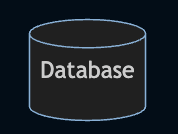

---

```markdown
flowchart LR
	id{조건1}
```

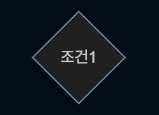

---

```markdown
flowchart LR
	id{{사람1}}
```


---

```markdown
flowchart LR
	id[/사람1/]
```


---

```markdown
flowchart LR
	id[\사람1\]
```


`/`와 `\`를 사용해서 모양을 자유롭게 만들 수 있습니다.

---

```markdown
flowchart LR
	id((사람1))
```


---

### Links / Edges

```markdown
flowchart LR
	id((사람1)) --> id2((사람2))
```

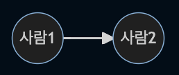

---

```markdown
flowchart LR
	id((사람1)) --- id2((사람2))
```

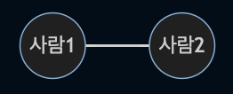

---

```markdown
flowchart LR
	id((사람1))-- 텍스트 ---id2((사람2))
```

또는

```markdown
flowchart LR
	id((사람1))---|텍스트|id2((사람2))
```

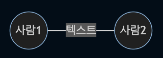

---

```markdown
flowchart LR
	id((사람1))-->|텍스트|id2((사람2))
```

또는

```markdown
flowchart LR
	id((사람1))-- 텍스트 -->id2((사람2))
```

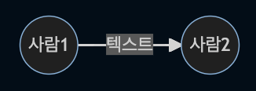

---

```markdown
flowchart LR
	id((사람1))-.->id2((사람2))
```

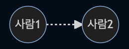

---

```markdown
flowchart LR
	id((사람1))-. 텍스트 .->id2((사람2))
```

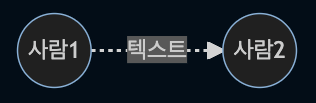

---

```markdown
flowchart LR
	id((사람1)) ==> id2((사람2))
```

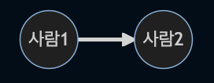

---

```markdown
flowchart LR
	id((사람1)) == 텍스트 ==> id2((사람2))
```


---

```markdown
flowchart LR
	id((사람1)) == 텍스트1 ==> id2((사람2))
	id((사람1)) == 텍스트2 ==> id2((사람2))
	id((사람1)) == 텍스트3 ==> id3((사람3))
	id((사람1)) == 텍스트4 ==> id4((사람4))
```

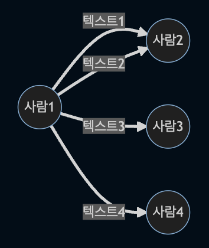

---

```markdown
flowchart LR
	id((사람1)) x-- 텍스트1 --x id2((사람2))
	id((사람1)) o-- 텍스트2 --o id2((사람2))
	id((사람1)) <-- 텍스트3 --> id3((사람3))
```

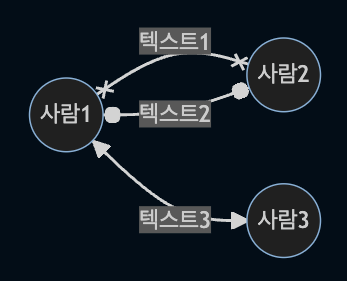

## 결론

mermaid의 기본적인 사용법을 알아보았습니다. 위에서는 flowchart로 설정하여 예시를 만들어보았는데, 다른 다이어그램을 사용할 때에 추가적으로 숙지해야할 것들이 있습니다. 공식문서를 참고하셔서 활용하시면 좋을 것 같습니다. ([공식문서](https://mermaid-js.github.io/mermaid/#/README)) **📊 Diagram Syntax** 부분을 참고하시면 문법에 대해서는 익숙해질 것 같습니다. 그리고 참고로 그냥 보는용이 아니라, npm을 통해서 다운로드 받아서 서비스에서도 사용이 가능합니다.
- Gatsby에서도 plugin이 있어서 공유하겠습니다. ([gatsby plugin](https://www.gatsbyjs.com/plugins/gatsby-remark-mermaid/))
- Notion에서도 /code 를 통해서 사용할 수 있습니다. ([Notion으로 다이어그램을 그린다고?](https://devocean.sk.com/blog/techBoardDetail.do?ID=164061))

## 참고

- [https://mermaid-js.github.io/mermaid/#/README](https://mermaid-js.github.io/mermaid/#/README)
- [https://sabarada.tistory.com/209](https://sabarada.tistory.com/209)