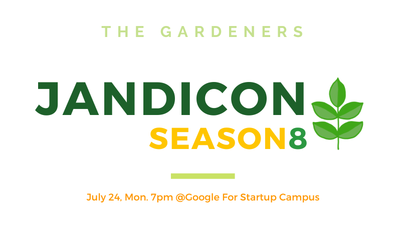

# 서론

"정원사들"이라는 활동은 Github에서 Commit이 발생할 때마다 생기는 초록색 네모 박스를, 잔디로 비유하면서 생겨난 활동이었습니다. 이 잔디들을 심어나가면서 정원을 만드는 정원사들. 즉, 1일 1 Commit을 하기 위해 사람들이 모여서 함께 독려하며 100일의 기간을 채우는 활동입니다. 이 활동에 참여하게 된 이유와 후기를 한 번 작성해 보았습니다.

# 본론

## 정원사들 시즌9에 참여한 이유

2023년 초부터 올 해의 목표를 "부지런한 사람이 되는 것 보다는, 부지런한 습관을 만들어보자."라고 생각했습니다. 그 습관의 첫 번째가 1일 1 Commit 이었습니다. 물론 초반부터 1일 1 Commit이 지켜지지는 않았고, 잔디에 탈모가 생기듯이 빈곳이 많았습니다.

그렇게 혼자 대단한 목적의식 없이 습관만들기를 하고 있을 무렵, GDG Pangyo의 잔디콘이라는 세미나를 알게 되었습니다. 이 잔디콘은 "정원사들 시즌8" 활동의 마무리를 하기 위한 모임이면서 세미나로서 다양한 사람들이 참여할 수 있는 곳이었습니다.

이 세미나를 참여하면서, "정원사들"이라는 활동에 대해서 알게 되었고, 시즌 9이 곧 시작된다는 것 또한 알게 되었습니다.

마침, 1일 1 Commit을 (탈모이긴 하지만)하고 있었던 저는 자연스럽게 참여하고 싶은 마음이 생겼습니다. 바로 신청을 해서 참여하게 되었습니다.

## 어떤 계획을 세웠나요?
 사실 1일 1 Commit은 하루에 한 번쯤 컴퓨터로 무엇인가 하는 습관을 들이기 위해 시작했기 때문에, 구체적인 계획은 없었습니다. 다만, 어떠한 것들을 할 것인지를 항상 생각을 했습니다.
 - TIL (Today I Learned) 작성
 - 알고리즘 문제 풀이
 - 블로그 글 작성
 - 사이드 프로젝트 진행
 - 책 요약
 - ...

정말 다양하게 생각을 했고, 그때 그때 하고싶은 것들을 하면서 잔디를 심어야겠다는 생각을 했습니다.

## 어떻게 실천했나요?
 아무리 하고 싶은 것들을 Commit한다고 해도, 매일 Commit을 하기란 쉽지 않았습니다. 여행도 가야했고, 컴퓨터를 못 쓰는 날도 있었기 때문입니다. 하지만, "정원사들" 이라는 활동에 참여하게 되면서, 출석부에 기록되어지는 커밋들이 자극이 되었던 것 같습니다. 여행을 가거나 컴퓨터를 못 할 것 같은 날에는 미리 Commit을 해두고 핸드폰으로 push 혹은 Merge를 하면서 잔디를 심었습니다. "이렇게 까지 해야하나.." 생각도 있었지만, 올 해 만큼은 습관을 제대로 만들고 싶었고, 조금은 독하게 하고 싶었습니다.

## 어떤 결과가 있었나요?
 1일 1 Commit. 사실 이것 자체만으로 많이 성장했다고 생각하지는 않습니다.

# 결론

잔디 심은거 이미지 쾅.

# 참조
