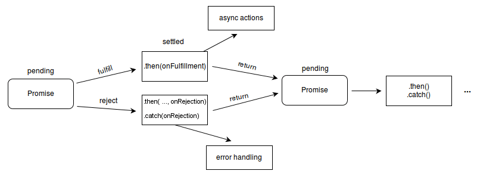

## 서론
Javascript의 Promise 객체에 대해서 정리를 해 보았습니다.

## 본론

### Promise는 무엇일까?

Promise는 Javascript에서 비동기로 동작하는 액션을 관리할 때에 사용하는 class 혹은 객체입니다. 로그를 찍어보아도 아래와 같이 표시됩니다.

```ts
console.log(Promise)
// ƒ Promise() { [native code] }
console.log(Promise.resolve())
// Promise {<fulfilled>: undefined}
```

만약 Promise를 사용하게 된다면 아래와 같이 사용할 수 있습니다.

```ts
const used  = new Promise((resolve, reject) => {
    resolve('나는 사용되었다..'); // 비동기 로직이라고 가정
});

used.then((text) => console.log('text:', text));

```
Promise 내부에서 비동기 로직을 사용하고, 로직이 완료되었을 때, resolve를 사용하여 `used`객체의 then이 실행될 수 있도록 설계할 수 있습니다. 이 방법을 사용한다면 API 통신 뿐만아니라, 배치 작업 등 비동기 작업을 수행할 수 있습니다.

resolve, reject, fulfilled와 같은 단어들이 보이는데, 이는 비동기를 위해 설계된 Promise가 가질 수 있는 상태와 연관이 있습니다. 이 Promise는 아래와 같이 3가지의 상태를 가지고 있습니다. 

- pending: `pending`은 비동기 액션이 시작되어서 종료되기 전까지의 상태를 의미합니다.
- fulfilled: `fulfilled`는 비동기 액션이 성공적으로 완료 되었을 때에 대한 상태를 의미합니다.
- rejected: `rejected`는 비동기 액션이 실패 혹은 에러로 인하여 종료되었을 때에 대한 상태를 의미합니다.   

MDN에서 이러한 상태를 도표로 정리해둔 내용이 있어 첨부를 해보겠습니다.



이 도표에 대한 설명을 추가로 하자면, Promise의 Pending이 끝나면, 성공 시 `fulfill`, 실패 시 `reject`로 분기가 되어집니다. 이 두 상태 모두를 포괄하는 의미 즉, Promise가 어떤 상태로든 종료된 것을 `Setted`라고 이야기 합니다. 또한, 이 Promise는 성공(fulfill)하였을 때는 `.then(callback)`으로 성공 관련 로직을 실행할 수 있습니다. 실패(reject)하였을 때는 `.then(_, callback)`(then의 두 번째 파라미터), `.catch(callback)`으로 에러를 핸들링할 수 있습니다. 그리고 `.then`의 callback에서 return된 값을 채이닝을 이용하여 또 Promise 객체를 반환하고, 다시 `.then`을 사용할 수 있습니다.

### Async/Await

Async/Await은 함수를 Promise를 반환하도록 만들어 주는 Javascript의 문법입니다. 아래와 같이 사용할 수 있습니다.

```ts
async function a() {
    // 저는 비동기 로직이에요.
    return 1;
    return Promise.resolve(1)
}

const b = a();

console.log(b);
// Promise {<fulfilled>: 1}
```

위와 같이 a함수에서는 1을 return 해주었는데 실행결과를 로그로 찍어보면, Promise 객체가 반환되는 것을 볼 수 있습니다. 또한 Promise.resolve(1)을 반환하더라도 결과는 같습니다. 이것이 async 키워드가 해주는 역합입니다. async가 붙은 함수는 위와같이 동작합니다.

또한, 이 async 함수는 await 키워드를 사용할 수 있는 조건을 만들어주는데, 아래와 같이 사용할 수 있습니다.

```ts
async function a() {
    // 저는 비동기 로직이에요.
    // return 1;
    return Promise.resolve(1)
}

async function b() {
    const aa = await a();
    return aa;
}
```
async 키워드가 포함된 함수 즉, async function은 함수 내부에서 await 키워드를 사용할 수 있도록 합니다. 이 await 키워드는 a함수가 setted된 상태까지 함수의 실행을 멈추어줍니다. 즉, b함수는 a함수가 setted 되기 전까지는 return 되어지지 않고, pending 상태를 유지합니다.


### 애매한 약속이 잡혔다
```ts
Promise.resolve('내가 1빠겠지?').then((res) => {
    console.log('[가장 위에 있는 log]:', res);
});

new Promise((resolve) => {
    setTimeout(() => {
        resolve('나는 느림의 미학을 추구해');
    }, 1000);
}).then((res) => {
    console.log('[중간에 있는 log]:', res);
});

console.log('[가장 밑에 있는 log]:', '출발이 늦어도 괜찮아');
```
위 코드에 있는 `console.log`가 실행되는 순서를 한 번 생각해 보겠습니다. `Promise.resolve`는 사실상 Setted된 Promise 이기 때문에 바로 로그가 출력이 될 것을 기대하게 됩니다. 중간 로그는 물론 1초 뒤에 실행이 될거고요. 마지막에 그냥 찍은 로그는 그냥 바로 실행이 될 것 같습니다. 결과는 아래와 같이 출력 됩니다.

```shell
[가장 밑에 있는 log]: 출발이 늦어도 괜찮아
[가장 위에 있는 log]: 내가 1빠겠지?
[중간에 있는 log]: 나는 느림의 미학을 추구해
```

우선, 이렇게 실행되는 이유를 알기 위해서는 싱글 스레드로 동작되어지는 Javascript의 동작에 대해서 알아야할 것 같습니다. 다행히도 [JavaScript Visualized - Promise Execution](https://www.youtube.com/watch?v=Xs1EMmBLpn4) 영상에서 자세히 설명을 해주고 있네요. 해당 영상의 내용중 필요한 부분만 설명을 첨부해 보겠습니다.

위와 같이 실행되는 이유를 순서에 촛점을 두고 설명을 해 보겠습니다.

단, 배경지식으로 아래 세 가지만 주입식 인지로 받아드려주세요.   
- Javascript에서는 모든 명령어가 실행되어지면 Call Stack이라고 하는 Stack 자료구조 형태로 모든 명령이 쌓입니다.
- Microtask Queue와 Task Queue가 있는데, Web API는 실행이 완료되면, 결과 값이 Task Queue로 이동됩니다. Promise.then에서 실행되는 내용은 Microtask Queue로 이동됩니다.
- Call Stack이 모두 실행되어서 비어진 경우에는 Microtask Queue에서 할일을 받아 온 다음에, Task Queue에서 다음 일을 받아온다. (Microtask Queue의 우선순위가 더 높습니다.)

1. Javascript가 실행이 되면, 위 내용을 한 번 쭉 실행합니다.
2. 그렇게 되면, Call Stack에는 Promise.resolve, new Promise, setTimeout, then, console.log([중간]), console.log(가장 밑) 등이 순서대로 쌓이게 됩니다.
3. 그런다음에, Promise.resolve는 Microtask Queue로 이동이 되어 관리 됩니다.
4. setTimeout은 WebAPI 영역에서 별도로 실행이 되어 1000ms 타이머를 동작 시킵니다.
5. console.log(가장 밑)이 바로 실행이 되어집니다.
6. Call Stack이 비었기 때문에, Microtask Queue의 내용인 `console.log([가장 위])` 실행 명령이 Call Stack으로 이동합니다.
7. console.log([가장 위])가 실행됩니다.
8. 1000ms가 지나면, Web API 영역에서 실행되어진 resolve가 Task Queue로 이동합니다.
9. Call Stack이 버있기 때문에, Task Queue의 내용은 Call Stack으로 이동합니다.
10. Call Stack에 있던 `resolve('나는 느림의 미학을 추구해')` 가 실행되어집니다.
11. resolve는 setted가 되는 시점에 다시 Microtask Queue로 이동합니다.
12. Call Stack이 버있기 때문에, Microtask Queue에 있는 내용은 Call Stack으로 이동합니다.
13. then에 있던 내용인 `console.log('[중간에 있는 log]:', '나는 느림의 미학을 추구해');`가 실행됩니다.

복잡하지만, 이렇게 하면 위 결과대로 로그가 찍히는 이유를 알 수 있습니다.

## 결론
Promise의 상태, Async/Await 그리고 Promise의 동작 방식에 대해서 간단하게 작성해봤습니다. 설명이 충분치 않은 부분이 있다고 생각된다면, 아래의 참조의 링크에서 좀 더 자세한 설명을 보셔도 좋을 것 같습니다. 

## 참조
- [MDN Promise](https://developer.mozilla.org/en-US/docs/Web/JavaScript/Reference/Global_Objects/Promise)
- [MDN Using Promises](https://developer.mozilla.org/ko/docs/Web/JavaScript/Guide/Using_promises)
- [async와 await](https://ko.javascript.info/async-await)
- [JavaScript Visualized - Promise Execution](https://www.youtube.com/watch?v=Xs1EMmBLpn4)