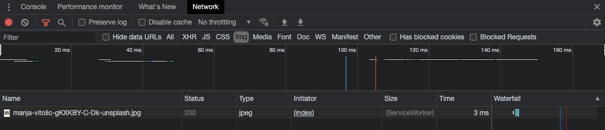

## [Service worker는 무엇일까요?](https://developer.mozilla.org/en-US/docs/Web/API/Service_Worker_API)

 ](./1.png)  
_그림 1 from [diagrams.net](http://diagrams.net/)_

> - 네트워크 요청을 인터셉트 할 수 있고 캐싱을 쉽게 할 수 있음
> - DOM API을 사용하는 부분과는 다른 Thread에서 동작하여 DOM API, XHR, Web Storage 등 에 접근이 불가능함.
> - 푸시 알림에 접근이 가능함
> - 보안상의 이유로 대부분의 브라우저에서 HTTPS에서만 동작 허용
>   - NOTE: FireFox는 HTTP에서 설정을 통해서 동작할 수 있습니다.

## 어떻게 사용 할까요?

저는 간단하게 Service Worker 환경을 만들고, 이미지가 캐싱 되는 과정을 설명하는 걸로 간단한 사용법 만을 소개하겠습니다.

### 간단한 환경을 설정

간단한 환경의 디렉토리를 보면

- index.html
- index.js
- service-worker.js

이렇게 만들었고 코드는 아래에 작성하였습니다.

```html
[index.html]
<!DOCTYPE html>
<html lang="ko">
  <head>
    <meta charset="UTF-8" />
    <meta http-equiv="X-UA-Compatible" content="IE=edge" />
    <meta name="viewport" content="width=device-width, initial-scale=1.0" />
    <title>Service Worker Test</title>
    <script src="index.js"></script>
  </head>
  <body>
    Service Worker Test
  </body>
</html>
```

```javascript
[index.js];
// navigator: 사용자의 상태를 알려주는 인터패이스
if ('serviceWorker' in navigator) {
  // Register a service worker hosted at the root of the

  window.addEventListener('load', () => {
    // site using the default scope.
    navigator.serviceWorker.register('/service-worker.js').then(
      function (registration) {
        console.log('Service worker registration succeeded:', registration);
      },
      /*catch*/ function (error) {
        console.log('Service worker registration failed:', error);
      }
    );
  });
} else {
  console.log('Service workers are not supported.');
}
```

```javascript
[service - worker.js];
console.log(`HI👋, I'm service-worker`);
```

실제 실행 화면입니다. (성공적으로 등록이 되었습니다. 하이하이)

  
_그림2_

개발자 도구의 Application 탭에서도 확인을 할 수 있습니다.

  
_그림3_

### 캐시 사용하기

위에서 셋팅한 환경에서 이미지를 하나 등록 해 보겠습니다.

```html
[index.html]
<!DOCTYPE html>
<html lang="ko">
  <head>
    <meta charset="UTF-8" />
    <meta http-equiv="X-UA-Compatible" content="IE=edge" />
    <meta name="viewport" content="width=device-width, initial-scale=1.0" />
    <title>Service Worker Test</title>
    <script src="index.js"></script>
  </head>
  <body>
    <header>Service Worker Test</header>
    <main>
      
    </main>
  </body>
</html>
```

- images
  - 이미지 파일
- index.html
- index.js
- service-worker.js

캐시를 사용하지 않고 이미지를 불러온 경우에는 개발자 도구의 network 탭에서

  
_그림4_

Size 부분에 통신한 용량을 표시 해 주고 있습니다.

이제 Service Worker에 캐시를 사용하는 코드를 적용 해 보겠습니다.

```javascript
[service - worker.js];
console.log(`HI👋, I'm service-worker`);

// * Cache의 버전
const CACHE_VERSION = 1;

// * Cache Storage의 이름
const Cache_NAME = `service-worker-v${CACHE_VERSION}`;

// * Cache 되기를 원하는 자원의 경로
const RESOURCES = ['/images/manja-vitolic-gKXKBY-C-Dk-unsplash.jpg'];

/**
 * * install: 해당페이지를 처음 방문할 때 install 이벤트 발생, 페이지 자원을 캐시하는 부분
 * * - application 탭에서 cache Storage에 등록 하는 콜백
 */
self.addEventListener('install', (event) => {
  console.log('installing..');
  event.waitUntil(
    caches.open(Cache_NAME).then((cache) => cache.addAll(RESOURCES))
  );
});

/**
 * * activate: 설치된 Service Worker가 제어 권한을 가지고 온 상태, push 및 sync와 같은 함수가 처리할 준비가 됨.
 */
self.addEventListener('activate', (e) => {
  console.log('activating...');
  e.waitUntil(
    caches.keys().then((keyList) => {
      return Promise.all(
        keyList.map((key) => {
          // * 원하지 않는 것들이 등록되어 있으면 삭제한다.
          if (Cache_NAME.indexOf(key) == -1) {
            return caches.delete(key);
          }
        })
      );
    })
  );
});

/**
 * * fetch: Service Worker를 설치 완료 후 캐시된 응답을 반환받음.
 * * - 네트워크 데이터가 있을 경우에 cache를 update하도록 하였음.
 */
self.addEventListener('fetch', (event) => {
  console.log('fetching...', event.request);
  event.respondWith(
    caches.open(Cache_NAME).then((cache) => {
      if (event.request.clone().method == 'GET') {
        return cache.match(event.request).then((response) => {
          const fetchPromise = fetch(event.request).then((networkResponse) => {
            cache.put(event.request, networkResponse.clone());
            return networkResponse;
          });
          return response || fetchPromise;
        });
      }
    })
  );
});
```

캐시를 적용한 후에는 Size 열에 ServiceWorker라고 표시가 되고 있습니다. [성공]

  
_그림5_

Application 탭에서 Cache 부분을 보면 Storage도 확인 할 수 있습니다.

  
_그림6_

이상으로 간단하게 환경을 만들어서 테스트 해 보았습니다.

## 결론

service-worker는 [workBox](https://developers.google.com/web/tools/workbox)라는 툴을 이용하여 더 편하게 사용을 하고 있다고 하여 간단하게만 다루어 보았습니다. 실제 사용을 위해서 workBox를 사용해 보면 좋을 것 같습니다.
