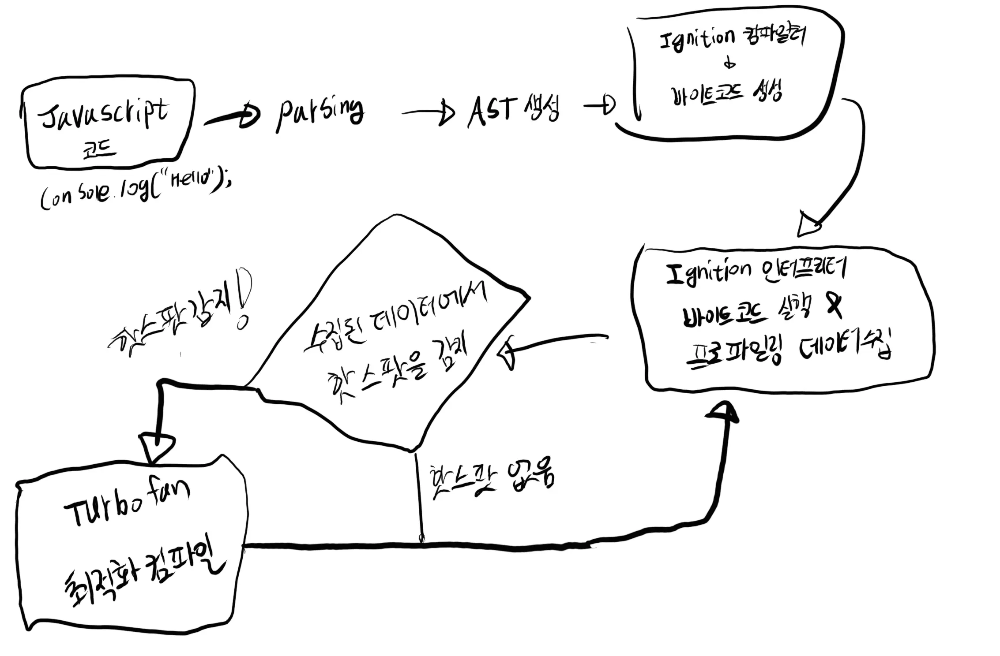
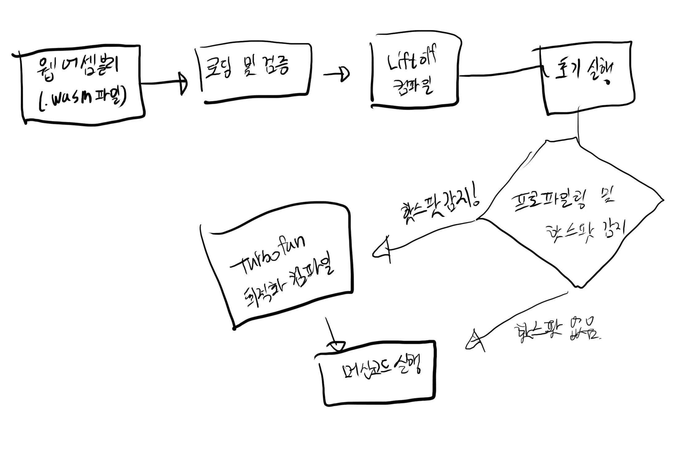

## 서론
웹어셈블리에 대해서 학습한 내용을 정리하였습니다.

## 본론
### 웹어셈블리는 무엇인가요?
웹어셈블리는 웹 브라우저에서 실행할 수 있는 비교적 새로운 포맷입니다. 이 포맷은 Javascript 보다 더 저수준 언어에 가깝고 평균적으로 더 나은 성능으로 실행될 수 있습니다. 그렇다면, 어떠한 차이 때문에 이러한 결과가 도출되었는지 한 번 알아보겠습니다.

#### 웹 브라우저에서의 Javascript
웹 브라우저는 JavaScript를 어떻게 실행할까요? 대부분의 프로그래밍 언어를 실행하기 위해서는 더 저수준 언어로 작성된 실행기인 엔진이 필요합니다. 크롬 웹 브라우저에서는 `V8`이라는 엔진을 사용해서 JavaScript를 실행하고 있습니다.

V8 엔진이 Javascript 코드를 실행하는 단계는 아래의 Flow 차트와 같습니다. 다만, 이해를 돕기 위해서 간단한 배경 지식을 설명하겠습니다.

- Ignition
	•	정의: Ignition은 V8 엔진의 인터프리터로, JavaScript 코드를 바이트코드로 컴파일하고 이를 실행하는 역할을 합니다.
	•	역할: Ignition은 JavaScript 코드를 빠르게 실행할 수 있도록 하며, 초기 실행 시점에서의 성능을 최적화합니다. 바이트코드를 실행하면서 성능 데이터를 수집하고 프로파일링을 수행합니다.
- Turbofan
	•	정의: Turbofan은 V8 엔진의 최적화 컴파일러로, 자주 실행되는 코드(핫스팟)를 최적화된 머신 코드로 변환합니다.
	•	역할: Turbofan은 Ignition에 의해 감지된 핫스팟을 더 효율적으로 실행할 수 있도록 최적화된 머신 코드로 컴파일하여 성능을 극대화합니다.
- AST (추상 구문 트리)
	•	정의: AST는 Abstract Syntax Tree의 약자로, 소스 코드의 구조를 트리 형태로 표현한 데이터 구조입니다.
	•	역할: JavaScript 소스 코드를 파싱하여 AST로 변환합니다. 이는 컴파일러가 소스 코드를 이해하고 변환하는 데 사용됩니다.
- 프로파일링
	•	정의: 프로파일링은 코드 실행 중에 성능 데이터를 수집하여 어떤 부분의 코드가 자주 실행되고, 시간이 많이 소요되는지를 분석하는 과정입니다.
	•	역할: V8 엔진은 Ignition 인터프리터가 바이트코드를 실행하는 동안 프로파일링을 수행하여 핫스팟을 감지합니다. 이 데이터는 Turbofan이 코드를 최적화하는 데 사용됩니다.
- 바이트코드
	•	정의: 바이트코드는 AST를 바탕으로 생성된 중간 표현 형태로, 컴파일된 코드가 아닌 해석(인터프리트)되어 실행되는 코드입니다.
	•	역할: Ignition 인터프리터는 JavaScript 소스 코드를 바이트코드로 변환하고, 이를 실행합니다.
- 머신 코드
	•	정의: 머신 코드는 CPU가 직접 실행할 수 있는 저수준의 기계어 코드입니다.
	•	역할: Turbofan 컴파일러는 바이트코드에서 핫스팟을 감지하여 이를 최적화된 머신 코드로 변환합니다. 최적화된 머신 코드는 성능이 뛰어납니다.
- 핫스팟
	•	정의: 핫스팟은 코드 실행 중 자주 실행되거나 시간이 많이 소요되는 부분을 의미합니다.
	•	역할: V8 엔진은 프로파일링을 통해 핫스팟을 감지합니다. Turbofan 컴파일러는 이러한 핫스팟을 최적화된 머신 코드로 변환하여 성능을 향상시킵니다.

---
##### Javascript 코드가 실행되는 과정

- JavaScript 코드는 파싱되어 AST로 변환됩니다.
- Ignition 컴파일러는 AST를 바이트코드로 변환합니다.
- Ignition 인터프리터는 바이트코드를 실행하면서 동시에 프로파일링 데이터를 수집합니다.
- 핫스팟 감지 단계에서 자주 실행되는 코드(핫스팟)가 있는지 확인합니다.
- 핫스팟이 감지되면: Turbofan 컴파일러가 이를 최적화된 머신 코드로 컴파일합니다.
- 핫스팟이 감지되지 않으면: Ignition이 커파일 및 실행을 진행합니다. 혹은 프로그램을 종료합니다.
- 최적화된 머신 코드가 실행된 후, 프로그램이 종료됩니다.
- Ignition 인터프리터는 바이트코드를 반복적으로 실행하며, 핫스팟이 감지될 때마다 Turbofan에 의해 최적화된 코드로 대체됩니다.

#### 웹 브라우저에서의 웹어셈블리

위에서 Javascript가 웹 브라우저에서 실행되는 것을 알아보았습니다. 이제 웹어셈블리가 웹 브라우저에서 어떻게 실행되는지 알아보고, 왜 더 성능이 좋다고 이야기 하는지 알아보겠습니다.

우선, 웹어셈블리는 V8엔진의 `Lifroff`라고 불리는 컴파일러로 변환 및 실행이 되어집니다. Liftoff는 아래와 같이 설명할 수 있습니다.

Liftoff
- 정의: Liftoff는 V8 엔진의 WebAssembly 전용 빠른 컴파일러입니다.
- 역할: Liftoff는 WebAssembly 코드를 빠르게 기계어로 컴파일하여 초기 실행 시간을 최소화합니다.
- 작동 원리:
    - 웹어셈블리 모듈이 로드되면, Liftoff가 이를 빠르게 기계어로 컴파일합니다.
    - 초기 실행 동안 코드를 빠르게 실행하여 사용자 경험을 향상시킵니다.
    - 이후, Turbofan이 자주 실행되는 코드(핫스팟)를 최적화된 머신 코드로 재컴파일하여 성능을 최적화합니다.

그렇다면 이 Liftoff가 웹 브라우저에서 어떠한 과정으로 실행이되어 웹어셈블리를 실행하는지 알아보겠습니다.

---

##### 웹어셈블리가 코드가 실행되는 과정

1.	로딩 및 검증 (Loading and Validation):
    - 웹어셈블리 모듈(.wasm 파일)이 로드되고, 유효성과 안전성이 검증됩니다.
2.	빠른 컴파일 (Compilation with Liftoff):
    - Liftoff 컴파일러가 웹어셈블리 바이너리를 빠르게 기계어(머신 코드)로 컴파일합니다. 이는 초기 실행 시간을 최소화하기 위해 사용됩니다.
3.	초기 실행 (Initial Execution):
    - Liftoff에 의해 컴파일된 머신 코드가 초기 실행됩니다.
4.	프로파일링 및 핫스팟 감지 (Profiling and Hotspot Detection):
    - 초기 실행 중에 V8 엔진은 성능 데이터를 수집하여 자주 실행되는 코드(핫스팟)를 감지합니다.
5.	최적화 컴파일 (Optimization with Turbofan):
    - 핫스팟이 감지되면, Turbofan 컴파일러가 해당 코드를 최적화된 머신 코드로 재컴파일합니다.
6.	최적화된 머신 코드 실행 (Optimized Machine Code Execution):
    - Turbofan에 의해 최적화된 머신 코드는 더 높은 성능으로 실행됩니다.
7.	프로그램 종료 (Program End):
    - 최적화된 머신 코드가 실행된 후, 프로그램이 종료됩니다.

얼핏 보면 Javascript가 실행되었을 떄의 과정과 유사해 보입니다. 하지만, 아래와 같은 이유로 Javascript 보다 좀 더 나은 성능을 가질 수 있습니다.

1.	바이너리 포맷:
    - 웹 어셈블리는 바이너리 포맷으로 작성되어 전송 및 로딩 속도가 빠릅니다. 이는 텍스트 기반의 JavaScript 코드보다 더 작고, 빠르게 전송될 수 있습니다.
2.	성능 최적화:
    - 웹 어셈블리는 네이티브 코드에 가까운 성능을 제공합니다. 이는 복잡한 계산이나 그래픽 처리와 같은 CPU 집약적인 작업에 적합합니다.

-> Turbofan을 사용한다는 점에서 Javascript의 사용 과정과 유사해 보일 수 있지만, 기본적인 포맷부터 차이가 있기때문에, 성능에 큰 영향을 줄 수 있습니다. 다만, `Liftoff`가 항상 Inigtion 보다 나은 성능을 갖지 않을 수 있습니다. 그렇기 때문에, 항상 웹어셈블리의 성능이 더 좋다고 말하지 않고, 때로는 더 좋다고 표현하는 것이 현재로서는 최선입니다.

### 웹어셈블리를 사용해 보기

#### React의 웹어셈블리 사용
1. React(next) 프로젝트 생성

## 결론

## 참조
- [웹어셈블리](https://tecoble.techcourse.co.kr/post/2021-11-24-web-assembly/)
- [카툰으로 소개하는 웹어셈블리](https://dongwoo.blog/2017/06/06/%eb%b2%88%ec%97%ad-%ec%b9%b4%ed%88%b0%ec%9c%bc%eb%a1%9c-%ec%86%8c%ea%b0%9c%ed%95%98%eb%8a%94-%ec%9b%b9%ec%96%b4%ec%85%88%eb%b8%94%eb%a6%ac/)