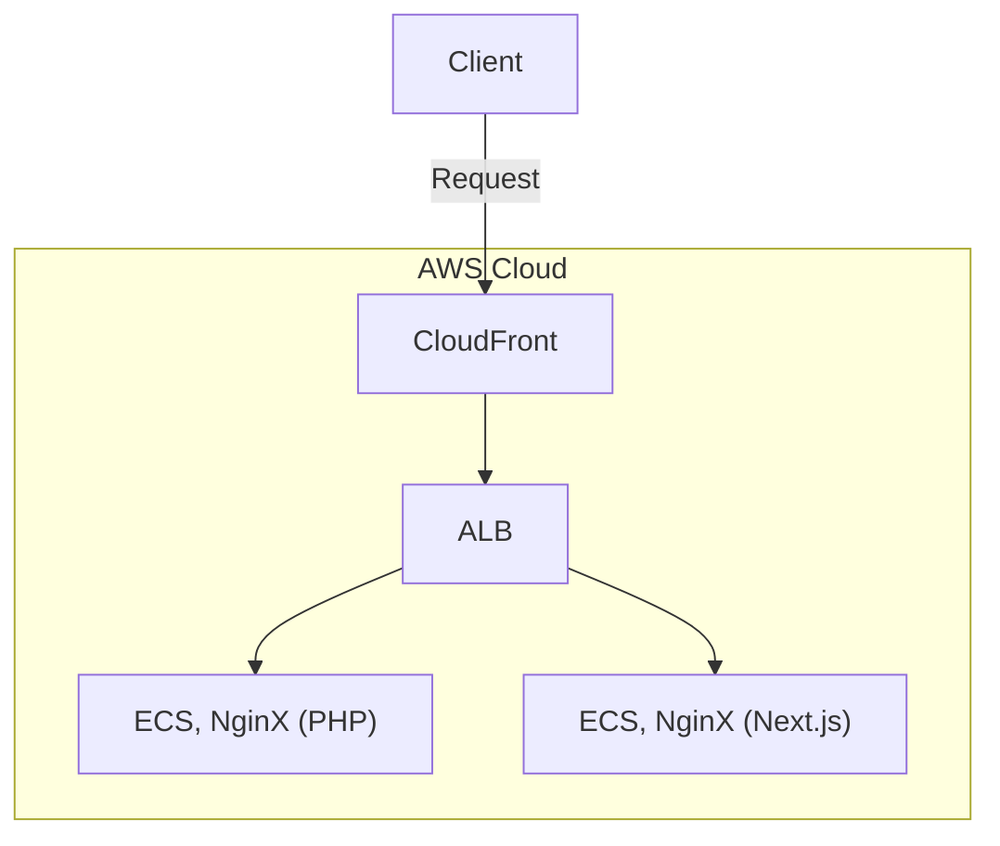

import { Page } from '@/components/Page'
import { SkillsOfProject } from '@/components/project/Skills'

<Page>
# 식봄
</Page>

<Page>
## 목차

</Page>

<Page>
## 식봄 소개
 식봄은 식자재 시장의 활성화를 목표로 개발된 B2B 커머스 플랫폼입니다. 이 플랫폼은 식자재 구매자와 판매자를 연결하여 효율적인 거래를 지원합니다. 특히, 판매자의 배송 유형에 따라 직배송, 택배배송 등으로 구분하여 상품을 노출하며, 이를 통해 구매자에게는 신선하고 다양한 식자재를, 판매자에게는 안정적인 판로를 제공합니다.
 
주요 특징:
- 다양한 컨텐츠 제공: 이벤트와 기획전을 통해 다양한 컨텐츠를 제공하여 즐거운 쇼핑 경험을 지원합니다.
- 판매/구입 편의 기능 제공: 다양한 검색어를 한 번에 검색할 수 있는 “한 번에 검색” 기능, 자주 구매하는 상품 및 최근 구매한 상품 등의 편의 기능을 통해 사용자에게 편리함을 제공합니다.
- 다양한 배송 옵션: 판매자의 물류 역량에 따라 직배송, 택배배송 등 다양한 배송 방식을 지원하여 구매자에게 최적의 배송 서비스를 제공합니다.
- 지역 기반 상품 노출: 상품의 배송 가능 지역을 기반으로 구매자에게 맞춤형 상품을 노출하여 지역 특산물의 유통을 촉진합니다.
- 실시간 재고 관리: 판매자는 실시간으로 재고를 관리하고, 구매자는 현재 재고 상황을 즉시 확인할 수 있어 원활한 거래가 가능합니다.
- 안전한 결제 시스템: 신뢰할 수 있는 결제 시스템을 통해 거래의 안전성을 보장합니다.
 
식봄은 이러한 기능들을 통해 식자재 유통의 효율성을 높이고, 구매자와 판매자 모두에게 만족스러운 거래 환경을 제공하고자 합니다.

</Page>

<Page>
## 무슨 일들이 있었나요?
2024년 01월 Commerce Dev팀에 합류하면서 식봄 서비스를 개발/운영 업무를 시작했습니다.
처음에는 PHP(Code Igniter)에서 Next.js로 전환을 어떤 방식으로 전환이 이루어지는가를 파악하였고, 
신규 기능(페이지) 개발과 기존 페이지를 Next.js로 전환하는 업무를 병행하며 프론트엔드 개발자로서 업무를 시작했습니다.
 
1. 로그인/회원가입 페이지 및 인증 로직 전환
2. 자주 구매하는 상품 페이지 신규 개발
3. 판매자 상세 페이지 개선 및 전환
4. 카테고리 상세 페이지 전환
5. 견적서 페이지 신규 개발
6. 알림센터 페이지 신규 개발
7. 검색 결과 페이지 전환
8. 한 번에 검색 페이지 신규 개발
9. 전국 택배 배송 페이지 전환
10. 브라우저 인쇄 템플릿 라이브러리 개발     
...ing
 
이러한 업무를 진행하였고, 아래와 같이 요약 & 카테고리를 만들 수 있을 것 같습니다.
- PHP to Next.js 전환/개선 및 UI 작업.
- 브라우저 인쇄 템플릿 라이브러리 개발.
- DataDog을 이용한 모니터링.

</Page>

<Page>
### PHP to Next.js 전환/개선 및 UI 작업
식봄은 기존에 Code Igniter라는 PHP 프레임워크를 사용하고 있었으며, 프론트엔드는 Next.js, 백엔드는 Kotlin Spring Boot로 전환하는 프로젝트입니다.
전환 작업을 진행하면서 새로운 기능도 함께 개발하였고, 그 과정에서 다양한 문제와 해결방법을 찾을 수 있었습니다. 아래에서 그 내용을 이야기 하겠습니다.
 
#### 사용된 기술 스택
 
<SkillsOfProject id="foodspring" />

</Page>

<Page>
#### 문제와 해결방법

##### 이렇게 많은 페이지를 어떻게 전환할 것인가?
- 기존 PHP 프로젝트의 페이지만 28개 이상이며 모바일/PC가 따로 구성되어 있는 상태이기 때문에,
     한 번의 배포로 모든 페이지를 전환하는 것은 성과는 없으면서 시간이 너무 오래 걸린다.
- 운영중인 서비스이기 때문에 변경 사항이 생기고, 전환되는 Next.js에서는 이 변경 사항을 반영해야 한다. 
    그러면 같은 요구사항을 두 번 작업해야하는 비효율이 발생한다.
 
###### 해결방법
AWS의 ALB(=Application Load Balancer)를 이용하면 같은 도메인이더라도, pathname에 따라서 PHP와 Next.js 서버로의 분기를 할 수 있기 때문에,
 이러한 기능을 이용하여 마치 피처플래그처럼 점진적인 전환 작업을 수행할 수 있었습니다.

 

###### 얻은 것
- 사용자가 서비스에 접속하는 Network 플로우를 직접 이용할 수 있게 되었고, 이는 Application 영역만 개발하였다면, 얻을 수 없는 경험이었다고 생각합니다.

</Page>

<Page>
##### PHP와 Next.js 서버는 서로 어떻게 인증할 것인가?
- 기존에 PHP에서는 cookie에 accessToken을 이용하여 회원 유저를 인증하였다.
- 로그인/회원가입 페이지를 전환하면서 accessToken의 발급 주체가 Next.js로의 이관이 필요했다.

###### 해결방법
단순 이메일 로그인 뿐만 아니라 소셜 로그인 또한 지원을 해야했기 때문에 [Next-Auth](https://next-auth.js.org/)를 이용하여 인증 로직을 간편하게 구현할 수 있었고,
기존 사용하던 방식을 이용하여 cookie에 accessToken을 저장을 하였습니다. 
또한 Next.js의 Middleware를 이용하여 모든 페이지 혹은 Network 통신에 accessToken의 유효성을 검증하는 로직을 추가하여 보안성을 강화하였습니다.

 
###### 얻은 것
- Cookie에 데이터를 저장하기 위해서 ExpireTime, Secure, HttpOnly 등의 속성을 설계 및 설정하는 경험을 할 수 있었습니다.

</Page>

<Page>
### 브라우저 인쇄 템플릿 라이브러리 개발
물류센터에서 사용하게 될 택배 라벨과 사장님들이 사용하게될 거래명세서를 인쇄할 때에, 외부 업체없이 브라우저의 기능만으로 인쇄를 진행하는 것을 목표로 개발을 진행.
또한, 당장은 PHP에서 사용이 되어지지만, 추후에는 Next.js에서도 사용할 수 있는 모듈 형태의 결과물이 필요.

##### 어떻게 브라우저의 인쇄 기능만으로 택배 라벨과 거래명세서를 인쇄할 것인가?

#### 문제와 해결방법 

</Page>

<Page>
### DataDog을 이용한 모니터링
##### 어떻게 서버로서의 Next.js의 Health Check, 에러 추적을 할 것인가?
- 특정 조건에 따라서 슬랙 알림으로 모니터링 하기
#### 문제와 해결방법 

</Page>
