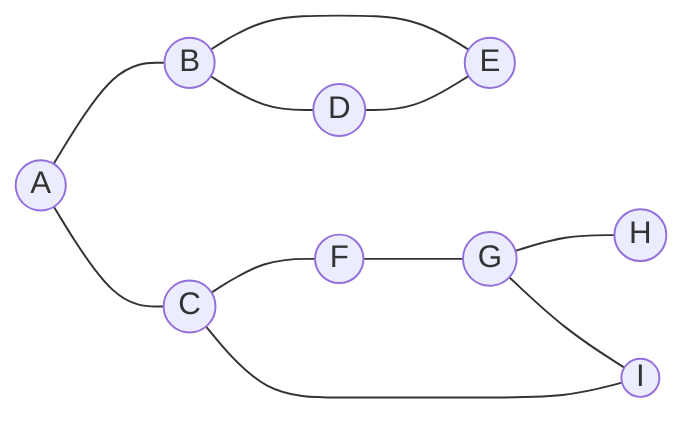
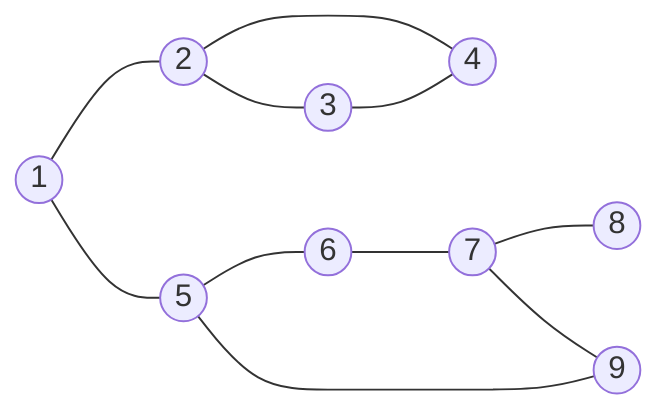

# Depth-First Search Algorithm

Depth-First Search Algorithm(=DFS)은 깊이 우선 탐색으로서, 자료구조인 Graph를 탐색하는 방법중 하나입니다.

## Grapgh

Graph는 아래의 도표와 같이 표현하는 자료구조이며, 동그라미를 정점(Vertex) 또는 노드(Node), 동그라미를 이어주는 선을 간선(Edge)이라고 표현합니다.



프로그래밍 언어로서 표현하면 아래와 같이 표현할 수 있습니다.

```
graph = {
    'A': ['B', 'C'],
    'B': ['A', 'D', 'E'],
    'C': ['A', 'F', 'I'],
    'D': ['B', 'E'],
    'E': ['B', 'D'],
    'F': ['C', 'G'],
    'G': ['F', 'H', 'I'],
    'H': ['G'],
    'I': ['G', 'C']
}
```

## DFS

DFS는 위 Graph를 탐색하는 것이며, 이름 그대로 깊이를 우선적으로 탐색하는 방법입니다.
시작 노드를 A로 하여 아래에 탐색 순서를 작성하였습니다.

1. 시작 노드 A를 방문하고, 방문한 노드 목록에 추가합니다.
   - 방문한 노드: [A]
2. 인접한 노드들 중 아직 방문하지 않은 노드를 찾아 이동합니다. 노드 A와 인접한 노드들은 B와 C입니다. 노드 B로 이동합니다.
   - 방문한 노드: [A, B]
3. 노드 B와 인접한 노드들 중 아직 방문하지 않은 노드를 찾습니다. 인접한 노드들은 A, D, E입니다. 이미 방문한 노드 A를 제외하고 노드 D로 이동합니다.
   - 방문한 노드: [A, B, D]
4. 노드 D와 인접한 노드들 중 아직 방문하지 않은 노드를 찾습니다. 인접한 노드들은 B와 E입니다. 이미 방문한 노드 B를 제외하고 노드 E로 이동합니다.
   - 방문한 노드: [A, B, D, E]
5. 노드 E와 인접한 노드들 중 아직 방문하지 않은 노드를 찾습니다. 인접한 노드들은 B와 D이지만 이미 방문한 상태입니다. 이전 노드인 D로 돌아갑니다.
6. 노드 D에서 다시 인접한 노드 중 방문하지 않은 노드를 찾습니다. 이전에 확인한 노드 E를 제외하고 다른 노드가 없으므로, 더 이상 방문할 노드가 없습니다. 이전 노드인 B로 돌아갑니다.
7. 노드 B에서 인접한 노드 중 방문하지 않은 노드를 찾습니다. 이전에 확인한 노드 D와 E를 제외하고 다른 노드가 없으므로, 더 이상 방문할 노드가 없습니다. 이전 노드인 A로 돌아갑니다.
8. 노드 A에서 인접한 노드 중 방문하지 않은 노드를 찾습니다. 노드 C로 이동합니다.
   - 방문한 노드: [A, B, D, E, C]
9. 노드 C와 인접한 노드 중 방문하지 않은 노드를 찾습니다. 인접한 노드들은 A, F, I입니다. 이미 방문한 노드 A를 제외하고 노드 F로 이동합니다.
   - 방문한 노드: [A, B, D, E, C, F]
10. 노드 F와 인접한 노드 중 방문하지 않은 노드를 찾습니다. 인접한 노드들은 C와 G입니다. 이미 방문한 노드 C를 제외하고 노드 G로 이동합니다.
    - 방문한 노드: [A, B, D, E, C, F, G]
11. 노드 G와 인접한 노드 중 방문하지 않은 노드를 찾습니다. 인접한 노드들은 F, H, I입니다. 이미 방문한 노드 F를 제외하고 노드 H로 이동합니다.
    - 방문한 노드: [A, B, D, E, C, F, G, H]
12. 노드 H와 인접한 노드 중 방문하지 않은 노드를 찾습니다. 인접한 노드는 G뿐이며 이미 방문한 상태입니다. 이전 노드인 G로 돌아갑니다.
13. 노드 G에서 인접한 노드 중 방문하지 않은 노드를 찾습니다. 이전에 확인한 노드 F와 H를 제외하고 노드 I로 이동합니다.
    - 방문한 노드: [A, B, D, E, C, F, G, H, I]
14. 노드 I와 인접한 노드 중 방문하지 않은 노드를 찾습니다. 인접한 노드들은 G와 C이지만 이미 방문한 상태입니다. 이전 노드인 G로 돌아갑니다.
15. 노드 G에서 인접한 노드 중 방문하지 않은 노드를 찾습니다. 이미 확인한 노드들 F, H, I를 제외하고 다른 노드가 없으므로, 더 이상 방문할 노드가 없습니다. 탐색을 종료합니다.

방문 순서를 숫자로 표기하여 아래와 같이 다시 Graph를 그려보았습니다.



DFS를 수행하는 javascript 코드를 작성하였습니다.

```js
const graph = {
  A: ['B', 'C'],
  B: ['A', 'D', 'E'],
  C: ['A', 'F', 'I'],
  D: ['B', 'E'],
  E: ['B', 'D'],
  F: ['C', 'G'],
  G: ['F', 'H', 'I'],
  H: ['G'],
  I: ['G', 'C']
};

function dfs(graph, startNode) {
  function explore(node, visited) {
    if (visited.has(node)) {
      return visited;
    }

    const newVisited = new Set(visited);
    newVisited.add(node);

    const neighbors = graph[node];
    return neighbors.reduce((acc, neighbor) => explore(neighbor, acc), newVisited);
  }

  const visited = explore(startNode, new Set());
  return Array.from(visited);
}

const visitedOrder = dfs(graph, 'A');
console.log(visitedOrder);
/** ['A', 'B', 'D', 'E', 'C', 'F', 'G', 'H', 'I'] */
```
