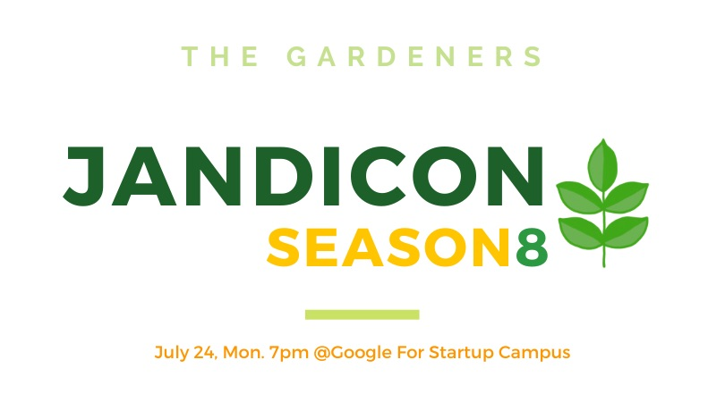
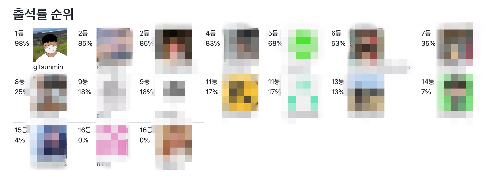
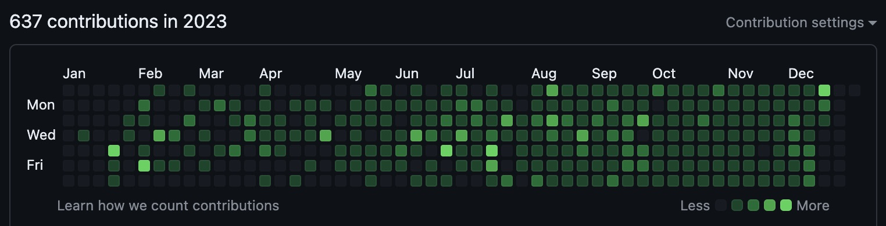

## 서론

GitHub에서 커밋이 발생할 때마다 생기는 초록색 박스를 '잔디'로 비유하곤 합니다. 매일 Commit을 하여, 잔디를 꽉 채운 '정원'을 가꾸는 '정원사들' 활동에 대해 이야기하고자 합니다. 이 글에서는 제가 이 활동에 참여하게 된 동기와 경험을 공유하려고 합니다.

> 정원사들: 100일간 1일 1 Commit을 하여, 잔디를 꽉 채우는 것을 목표로 합니다.

## 본론

### 정원사들 시즌9에 참여한 이유

2023년의 목표는 "Output 보다는, 습관을 만들어 보자." 였습니다. 그리고 그 습관의 첫 번째가 1일 1 Commit 이었습니다. 물론 초반부터 1일 1 Commit이 지켜지지는 않았고, 잔디에 탈모가 생기듯이 빈 곳이 많았습니다. 그렇게 혼자서 습관만들기를 하고 있을 무렵, GDG Pangyo의 잔디콘이라는 세미나를 알게 되었습니다. 이 잔디콘은 "정원사들 시즌8" 활동의 마무리를 하기 위한 모임이면서 세미나로서 다양한 사람들이 참여할 수 있는 곳이었습니다.

이 세미나를 참여하면서, "정원사들"이라는 활동에 대해서 알게 되었고, 시즌 9이 곧 시작된다는 것 또한 알게 되었습니다.

마침, 1일 1 Commit을 (탈모이긴 하지만)하고 있었던 저는 자연스럽게 참여하고 싶은 마음이 생겼고, 바로 신청을 했습니다.

### 어떤 계획을 세웠나요?

사실 1일 1 Commit은 하루에 한 번쯤 컴퓨터로 무엇인가 하는 습관을 들이기 위해 시작했습니다. 그렇기 때문에, 구체적인 계획 보다는 아래의 목록 처럼, 하고 싶은 것들은 다 하려고 했습니다.

- TIL (Today I Learned) 작성
- 알고리즘 문제 풀이
- 블로그 글 작성
- 사이드 프로젝트 진행
- 책 요약
- ...

정말 다양한 것들을 생각 했고, 그때 그때 하고싶은 것들을 하면서 잔디를 심어야겠다는 생각을 했습니다.

### 어떻게 실천했나요?

아무리 하고 싶은 것들을 Commit 한다고 해도, 매일 Commit을 하기란 쉽지 않았습니다. 여행도 가야했고, 컴퓨터를 못 쓰는 날도 있었기 때문입니다. 하지만, "정원사들" 이라는 활동에 참여하게 되면서, 출석부에 기록되어지는 Commit들이 자극이 되었던 것 같습니다. 여행을 가거나 컴퓨터를 못 할 것 같은 날에도 테블릿이나 스마트폰을 이용하여 간단한 문서라도 Commit을 했습니다.

### 어떤 결과가 있었나요?

1일 1 Commit을 통해서는 사실 큰 성장은 없었습니다. 다만, 처음 목표인 "습관 만들기"에는 너무나도 좋은 방법이었다고 생각합니다. 처음부터 포커스를 "습관 만들기"에 두었기 때문에, 한 Commit 들에 대한 부담이 적었습니다. 덕분에 100일 중에 98%의 출석률을 만들 수 있었고, 아직까지도 퇴근 후에 잠깐이라도 컴퓨터로 공부를 하거나 블로그 글을 쓰는 등의 습관을 이어가고 있습니다.

### 앞으로는 어떤 계획이 있나요?

이제는 퇴근 후에 컴퓨터로 무엇인가 하는 습관이 형성되었다고 생각합니다. 그래서, 앞으로는 이 습관을 이용해서 Output을 만들어 보려고 합니다. 다만, 습관을 잘못 들여서 그런지, "하고 싶은 것"이어야 합니다... 그래서, 앞으로는 아래와 같은 것들을 하고 싶습니다.

- 블로그 글 작성: 공부한 것들을 공유하는 것의 중요성을 최근에야 알게 되었습니다. 내가 먼저 공유해야 다른 이가 공유할 수 있기 때문에, 블로그 글을 작성하고 공유하려고 합니다.
- 사이드 프로젝트 진행: 사이드 프로젝트를 진행하면서, 새로운 기술을 배우고, 새로운 경험을 쌓고 싶습니다.
- 오픈 소스 프로젝트 참여: 오픈 소스 프로젝트에 참여하면서, 다른 사람들과 함께 성장하고 싶습니다.
- ...

## 결론

"정원사들" 활동은 1일 1 Commit을 하는 습관을 만들기에 너무나도 좋은 활동이었습니다. 덕분에 게으른 인생에 조금이라도 부지런한 습관이 자리를 잡을 수 있었습니다. 앞으로는 이 습관을 이용해서 프론트엔드 개발자로서 성장하고, 다른 사람들에게 도움이 되는 Output을 만들어 보려고 합니다.

## 참조

- [잔디콘 시즌 8](https://festa.io/events/3790)
