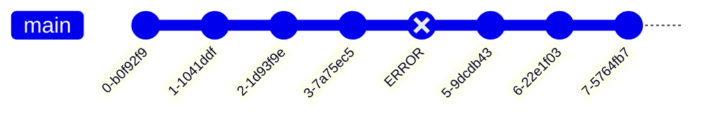

# Git Bisect Command

git-bisect - 이진 검색을 사용하여 버그를 발생시킨 커밋을 찾는다.

```bash
git bisect <subcommand> <options>
```

`git bisect`는 commit log를 이진 검색하면서 버그를 찾는데 사용할 수 있습니다.

- 버그가 일어나는 commit을 선택합니다.
- 버그가 일어나지 않는 commit을 선택합니다.
- `git bisect`는 이 두 commit 사이에서 이진 탐색으로 commit을 선택하고 선택한 commit이 버그가 일어나는 commit인지 아닌지 묻습니다. (이진 탐색)
- 버그가 일어난다면, `bad`, 버그가 일어나지 않는다면, `good`을 입력합니다.
- 이 과정을 반복하면서 버그가 일어나는 commit을 찾습니다.

위와 같은 방식으로 버그를 찾는 것이 `git bisect`입니다.

아래에 예시를 보여드리겠습니다.



위와 같은 commit log가 있고, `ERROR`라고 명시된 commit에서 버그가 발생했다고 가정하겠습니다.

`git bisect`를 사용하여 버그가 발생한 commit을 찾아보겠습니다.

`git bisect start`를 입력하면 `git bisect`를 시작합니다.

```bash
git bisect start
```

```console
> status: waiting for both good and bad commits
```

그리고, 현재 브랜치의 현재 커밋이 에러가 발생한다면, `git bisect bad`를 입력합니다. 혹은 커밋이 아니라면 `git chekcout`을 이용해서 에러가 발생하는 커밋으로 이동하여 `git bisect bad`를 입력합니다.

```bash
git bisect bad
```

```console
> status: waiting for good commit(s), bad commit known
```

그리고, 에러가 발생하지 않는 커밋으로 이동합니다.

```bash
git checkout 0-28e2d1c
```

해당 커밋을 확인하고, 에러가 발생하지 않는다면 `git bisect good`을 입력합니다.

```bash
git bisect good
```

```console
> Bisecting: 2 revisions left to test after this (roughly 2 steps)
[hashcodehashcodehashcode] (commit message)
```

그러면 `git bisect`가 이진 탐색을 하면서 commit을 선택해줍니다. 그리고, 해당 commit에서 에러가 발생하는지 확인하면 되는 겁니다.

만약, 에러가 발생한다면 `git bisect bad`를 입력하고, 에러가 발생하지 않는다면 `git bisect good`을 입력합니다.

계속 반복을 하다가, `bad`인 commit을 찾는다면, 해당 커밋으로 부터 버그가 유지가 되었다고 판단할 수 있습니다. git bisect는 이러한 방식으로 버그를 찾아줍니다.

몇 가지 TIP:

1. 이미 알고 있다면, checkout을 하지 않아도 됩니다.

```bash
$ git bisect good <commit>
$ git bisect bad <commit>
$ git bisect reset <commit>
```

이렇게 checkout을 하지 않고도 대항 커밋에 대한 체크 및 초기화를 할 수 있습니다.

2. 꼭, `good`, `bad`를 입력하지 않아도 됩니다.

```bash
$ git bisect start --term-old <term-old> --term-new <term-new>
```

이렇게 `--term-old`와 `--term-new`를 이용해서 `git bisect`를 원하는 이름으로 시작할 수 있습니다.

예시)

```bash
git bisect start --term-old fast --term-new slow
```

3. 현재 상태를 체크할 수 있습니다.

```bash
$ git bisect log
```

4. 확인이 불가능한 경우에는

```bash
$ git bisect skip
$ git bisect skip <commit>
```
