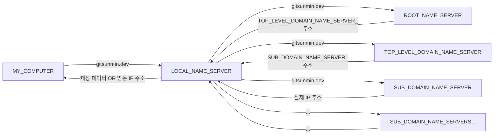
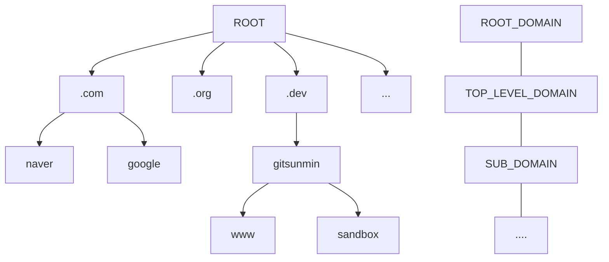

## DNS (Domain Name System)

Domain Name System(이하 DNS)은 사용자가 입력한 URL 주소를 IP 주소로 변환하여 실제 서버가 운영되는 IP주소를 알 수 있도록 도와주는 System입니다.

우리가 브라우저 창에서 URL(`gitsunmin.dev`)을 입력한다면, 컴퓨터는 해당 URL(`gitsunmin.dev`)을 LOCAL_DOMAIN_NAME_SERVER로 요청을 보내게 되는데, 이 LOCAL_DOMAIN_NAME_SERVER는 Internet Service Providers, [ISP](https://ko.wikipedia.org/wiki/%EC%9D%B8%ED%84%B0%EB%84%B7_%EC%84%9C%EB%B9%84%EC%8A%A4_%EC%A0%9C%EA%B3%B5%EC%9E%90) 라고 부르는 제공자가 운영하는 DNS 서버로서 요청받은 URL을 받아서 실제 IP 주소가 우리 컴퓨터에 전달 되도록 돕는다. 돕는 과정중에는 캐싱되어 있는 IP주소를 내보내주기도 하며, 아래의 그림 처럼 가장 상단의 ROOT_NAME_SERVER에게 URL을 보내고, 받은 하위 NAME_SERVER의 주소로 다시 하위 NAME_SERVER에게 URL주소를 요청하여 실제 IP 주소를 받기 위해 반복적으로 요청을 보냅니다.

이렇게 IP를 찾을 수 있는 이유는 DOMAIN이라고 하는 것이 아래의 그림처럼 계층 구조를 갖고 있기 떄문입니다.

참고할 사항
- 우리나라에 등록된 ISP ([주소](https://db-ip.com/country/KR))
- ROOT DOMAIN NAME SERVER ([주소](https://ko.wikipedia.org/wiki/%EB%A3%A8%ED%8A%B8_%EB%84%A4%EC%9E%84_%EC%84%9C%EB%B2%84))